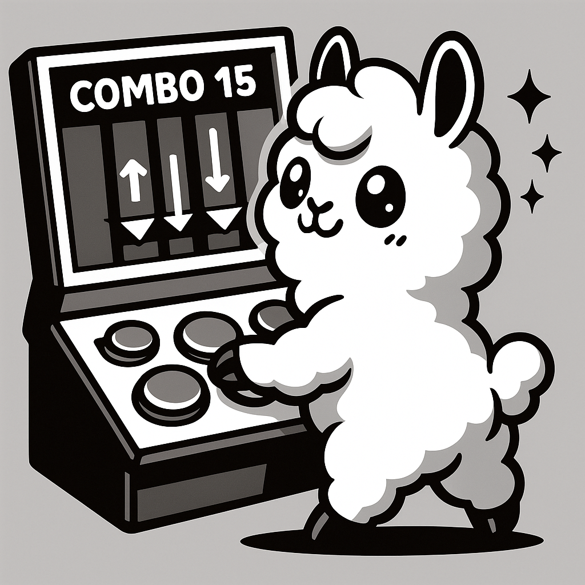

# 🎵 節奏遊戲 (Rhythm Game)



一個基於 Web 的節奏遊戲，可以上傳音樂檔案並自動生成遊戲譜面進行遊玩。

## 🌟 主要功能

### 🎶 音樂上傳
- 支援多種音樂格式 (WAV、MP3)
- 智能檔名管理

### 🎯 自動譜面生成
- **平衡節拍分配**：基於音樂節拍和能量分析，智能分配音符到 4 個軌道
- **能量分析**：根據音樂的頻率特徵分配音符位置

### 🎮 遊戲體驗
- 4 軌道節奏遊戲 (使用 D、F、J、K 鍵)
- 即時判定系統 (Perfect、Great、Good、Miss)
- 分數和連擊系統

### ⚙️ 自定義設定
- 音符速度調整
- 判定容差設定
- 音頻延遲補償
- 視覺偏移調整

## 🚀 快速開始

### 系統需求
- Python 3.11
- 現代瀏覽器 (Chrome、Firefox、Safari、Edge)

### 安裝步驟

1. **克隆專案**
```bash
git clone <repository-url>
cd RhythmForge
```

2. **安裝依賴**
```bash
pip install -r requirements.txt
```

3. **啟動應用**
```bash
python app.py
```

4. **開啟瀏覽器**
   - 訪問 `http://localhost:5000`
   - 開始使用！

## 📖 使用指南

### 1. 上傳音樂
1. 點擊「上傳音樂」頁面
2. 選擇本地音樂檔案 (支援 WAV、MP3 格式)
3. 點擊「上傳」按鈕
4. 等待上傳完成

### 2. 生成譜面
1. 進入「生成譜面」頁面
2. 選擇已上傳的音樂檔案
3. 選擇生成方法：
   - **平衡節拍分配** (推薦)：產生更平衡且符合節奏的譜面
   - **能量分析**：基於音樂頻率特徵分配
4. 點擊「生成譜面」
5. 等待分析完成

### 3. 開始遊戲
1. 前往「可用譜面」頁面
2. 選擇想要遊玩的譜面
3. 點擊「開始遊戲」
4. 按 Enter 開始遊戲
5. 使用 D、F、J、K 鍵按下對應軌道的音符

### 4. 遊戲控制
- **D、F、J、K**：對應 4 個軌道
- **Enter**：開始遊戲
- **ESC**：暫停/繼續
- **R**：重新開始

## ⚙️ 遊戲設定

### 判定容差
- **Perfect**：最精確的判定
- **Great**：良好的判定
- **Good**：可接受的判定

### 校準設定
- **音頻延遲補償**：如果覺得需要提早按才是 Perfect，請增加此值
- **視覺偏移**：如果音符位置與音樂不同步，請調整此值

## 🐛 常見問題

### Q: 音樂上傳失敗？
A: 請檢查：
- 檔案格式是否支援 (WAV、MP3)
- 檔案大小是否合理
- 瀏覽器是否支援檔案上傳
- 嘗試重新上傳

### Q: 譜面生成沒有音符？
A: 可能原因：
- 音樂檔案損壞
- 音樂過於安靜或單調
- 嘗試使用不同的生成方法

### Q: 遊戲延遲問題？
A: 解決方法：
- 調整「音頻延遲補償」設定
- 使用有線耳機減少延遲

### Q: 按鍵沒有反應？
A: 檢查：
- 瀏覽器是否支援 JavaScript
- 遊戲頁面是否正確載入
- 按鍵是否正確 (D、F、J、K)

## 📄 授權

此專案僅供學習和個人使用。請遵守相關音樂版權法律。

---

**享受節奏遊戲的樂趣！** 🎵🎮 